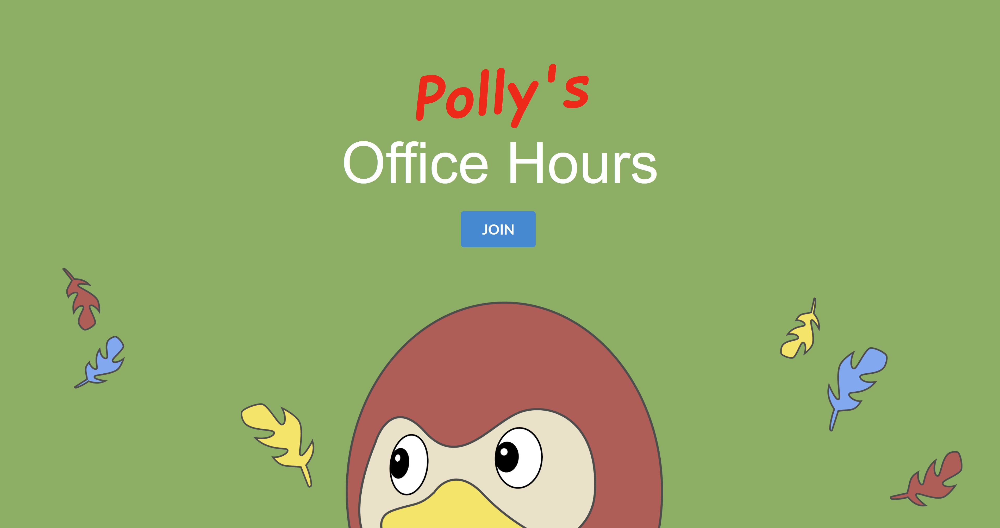

# Polly's Office Hours

A parody of cmu.ohqueue.com inspired by the method of [rubber duck debugging](https://en.wikipedia.org/wiki/Rubber_duck_debugging).

## Tools used
[SheetBest](https://sheet.best) to use a Google Sheets as a backend. 
[howler.js](https://howlerjs.com) to play audio. 
[Semantic UI React](https://react.semantic-ui.com) for styling.

Built with ReactJs.

## Available Scripts

In the project directory, you can run:

### `npm start`

### `npm run build`

### Sound bites

Incredible parrot sounds can be found here:
https://www.youtube.com/watch?v=1f7RepmiG9M
https://www.youtube.com/watch?v=QHsowSZHVuA
